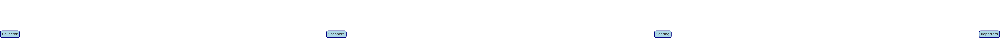
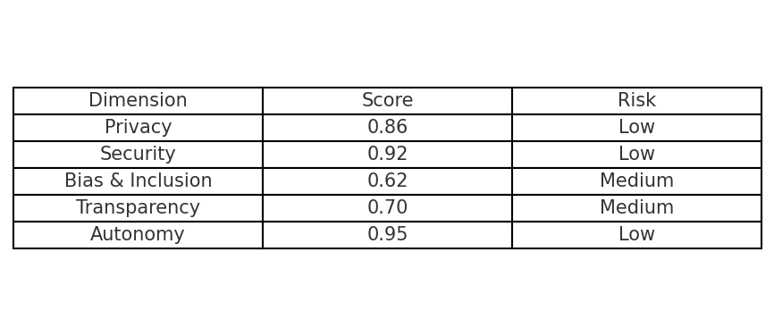

# ETHICSENSE

**Accessible AI Ethics for Everyone**

ETHICSENSE is a lightweight toolkit that scans AI products and outputs to assess risks across **privacy, security, autonomy, bias, inclusiveness, transparency, and reliability**. It helps teams identify issues before deployment — making ethical AI governance radically accessible for **non-technical teams, smaller organizations, and anyone committed to digital dignity.**

---

## 1. ETHICSENSE in 20 Seconds
ETHICSENSE = *Collector → Scanners → Scoring → Reporters*.  
It ingests simple files (prompts/outputs, configs), runs modular scanners, assigns scores per ethical dimension, and produces a JSON Scorecard plus a human-readable Model Card.

  
*(Collector → Scanners → Scoring → Reporters)*

---

## 2. What It Does (v0.1 Scope)

**Inputs supported:**
- `inputs_outputs.jsonl` (each line: `prompt`, `output`, optional `user_group`)  
- `ethicsense.yml` (project name, declared purpose, intended users, sensitive data flags)

**Scanners shipped in v0.1:**
- **Privacy** – PII pattern detector + optional denylist  
- **Security** – prompt-injection heuristics  
- **Bias & Inclusion** – non-inclusive term list + basic parity check (if labels provided)  
- **Transparency** – checks for disclosures & capability limits in UI copy  
- **Autonomy** – flags manipulative directives (pressure, coercion)

**Outputs:**
- JSON Scorecard  
- Markdown Model Card  

---

## 3. Quick Start

Run your first scan in **2 minutes**:

```bash
pip install ethicsense
ethicsense scan examples/healthcare/inputs_outputs.jsonl \
  --config examples/healthcare/ethicsense.yml \
  --out results/
```

Generates:
- `results/scorecard.json`
- `results/model_card.md`

---

## 4. How It Works

1. **Collector** – gathers inputs (outputs.jsonl, configs)  
2. **Scanners** – run dimension checks (privacy, bias, etc.)  
3. **Scoring** – apply rubric, assign 0–100 per dimension  
4. **Reporters** – write JSON + Markdown reports

---

## 5. Scorecard Rubric (v0.1)

| Dimension    | Signals Tested                          | Thresholds / Example |
|--------------|-----------------------------------------|----------------------|
| Privacy      | PII patterns (SSN, email)               | <1% flagged = Pass   |
| Security     | Prompt injection heuristics              | No injections = Pass |
| Bias/Inclusion | Term list hits, parity gaps >10%      | <5% gap = Green      |
| Transparency | Disclosure presence in UI/docs          | Present = Pass       |
| Autonomy     | Manipulative phrasing (coercion verbs)  | Zero hits = Pass     |

---

## 6. Examples

- [Sample Healthcare Run](examples/healthcare/)  
- [Scorecard JSON](examples/healthcare/results/scorecard.json)  
- [Model Card (Markdown)](examples/healthcare/results/model_card.md)  



---

## 7. Roadmap

- **v0.1 (MVP):** CLI, text-only scans, JSON/Markdown output  
- **v0.2:** CI/CD integration, richer dataset scans, team dashboards  
- **v0.3:** Plugin ecosystem + community risk libraries

---

## 8. Who Uses It, When

**Recipes:**
- Pre-deployment check  
- Red-team prompts for bias/privacy  
- Release gate before production  
- Vendor evaluation (scan 3rd-party models)

---

## 9. Contributing, License, Disclaimer

- **License:** [MIT](docs/license.md)  (see LICENSE file)  
- **Contributing:** [Contributiong](docs/contributing.md) See CONTRIBUTING.md  
- **Disclaimer:** ETHICSENSE flags potential risks. It is advisory only and not a substitute for regulatory/legal compliance. See [Full Disclaimer](docs/disclaimer.md)

---

## 10. Background: Why ETHICSENSE?  

Most responsible AI toolkits are built for technical experts and large organizations, focusing narrowly on statistical fairness or compliance. **ETHICSENSE is different.** We make ethical AI governance radically accessible for non-technical teams, resource-limited organizations, and anyone committed to human-centered technology.  

ETHICSENSE puts *digital dignity* at the heart of every project, going beyond fairness to emphasize autonomy, respect, privacy, and transparency throughout the AI lifecycle. With step-by-step guides, practical templates, and clear communication tools, ETHICSENSE bridges the gap between technical analysis and real-world ethical action — empowering diverse teams to evaluate, document, and improve their AI systems quickly, affordably, and with confidence.
